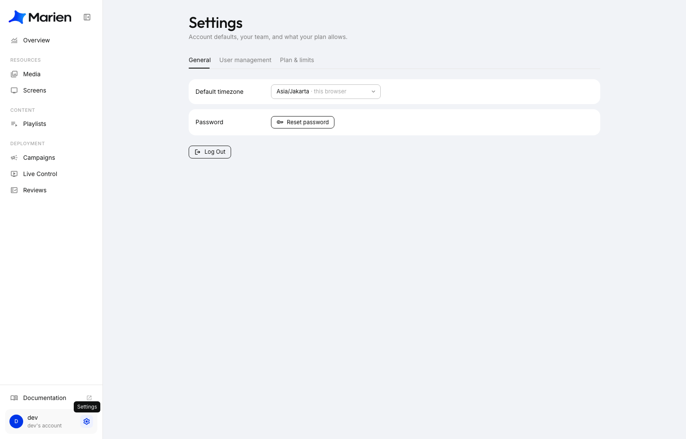
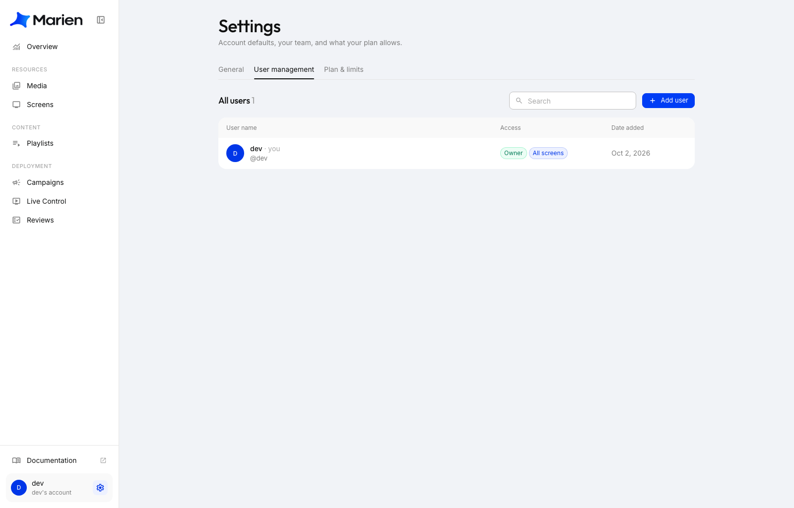
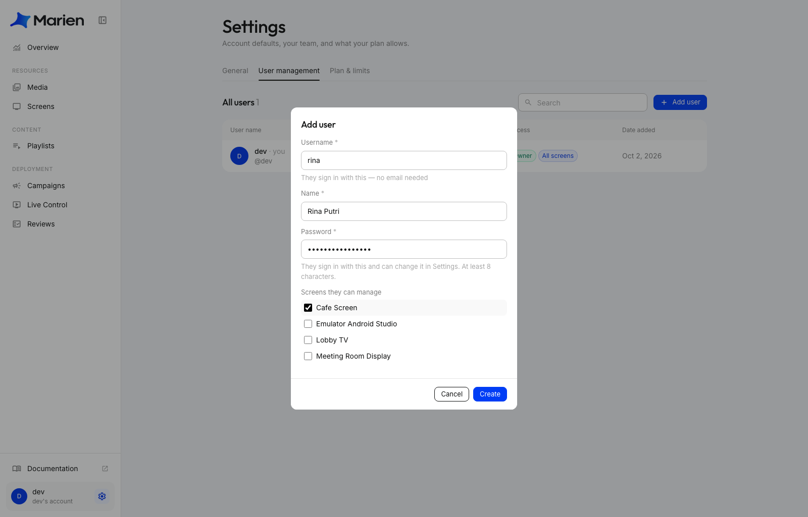
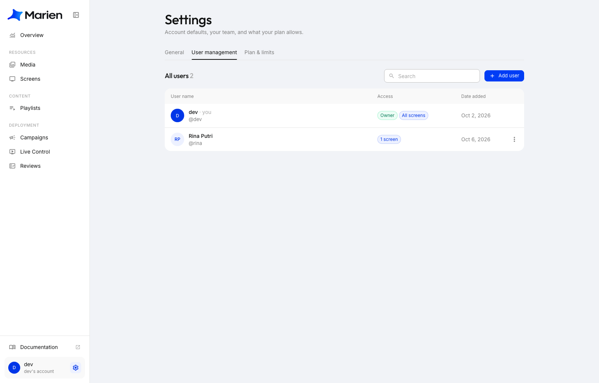

# Tambah Sub-account

Sub-account adalah akun login untuk orang di timmu: staf, manajer cabang, atau agensi. Mereka punya username dan password sendiri, dan hanya melihat layar yang kamu pilihkan. Dengan begitu, kamu tidak perlu membagikan password milikmu sendiri.

Hanya pemilik akun (owner) yang bisa menambahkan sub-account.

## Buat sub-account

**1.** Di Marien CMS, klik **ikon roda gigi** di sebelah namamu di kiri bawah untuk membuka **Settings**.

**2.** Buka tab **User management**. Di sini kamu melihat semua orang yang bisa masuk ke akunmu. Klik **Add user**.

**3.** Isi formulirnya:

- **Username:** yang diketik untuk masuk. Tidak perlu alamat email.
- **Name:** nama yang tampil di Marien.
- **Password:** minimal 8 karakter. Nanti bisa mereka ganti sendiri.
- **Screens they can manage:** centang layar yang boleh mereka kelola.

Klik **Create**.

**4.** Selesai. Orang barunya muncul di daftar, dengan label kecil yang menunjukkan berapa layar yang bisa dia jangkau.

**5.** Kirimkan username dan password-nya kepada mereka, beserta alamat untuk masuk: **app.marien.co.id**. Mereka bisa mengganti password lewat **Settings**, lalu **Reset password**.

!!! warning
    Berikan password dengan cara yang aman, bukan di grup chat yang bisa dibaca banyak orang. Minta mereka mengganti password-nya saat pertama kali masuk.

## Kelola sub-account nanti

Klik tiga titik di ujung barisnya.

- **Change screens:** pilih layar mana saja yang boleh mereka kelola.
- **Reset password:** buatkan password baru (misalnya saat mereka lupa). Mereka akan keluar dari semua perangkat dan harus masuk lagi dengan password yang baru.
- **Deactivate:** mereka tidak bisa masuk sampai kamu klik **Reactivate**. Tidak ada yang mereka buat yang terhapus.
- **Delete user:** akses mereka langsung dicabut. Media dan playlist yang pernah mereka buat tetap ada di akunmu.

!!! note
    Sub-account hanya melihat layar yang kamu berikan, dan mereka tidak bisa membuka **User management**. Kalau mereka mengubah sesuatu yang akan tampil di layar, kamu yang menyetujuinya lebih dulu (lihat [Cara Kerja Review](how-reviews-work.md)). Hal-hal lain langsung tersimpan.
