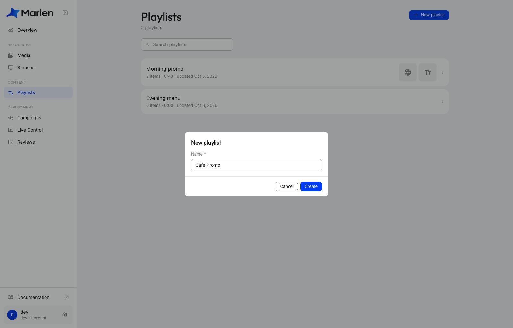
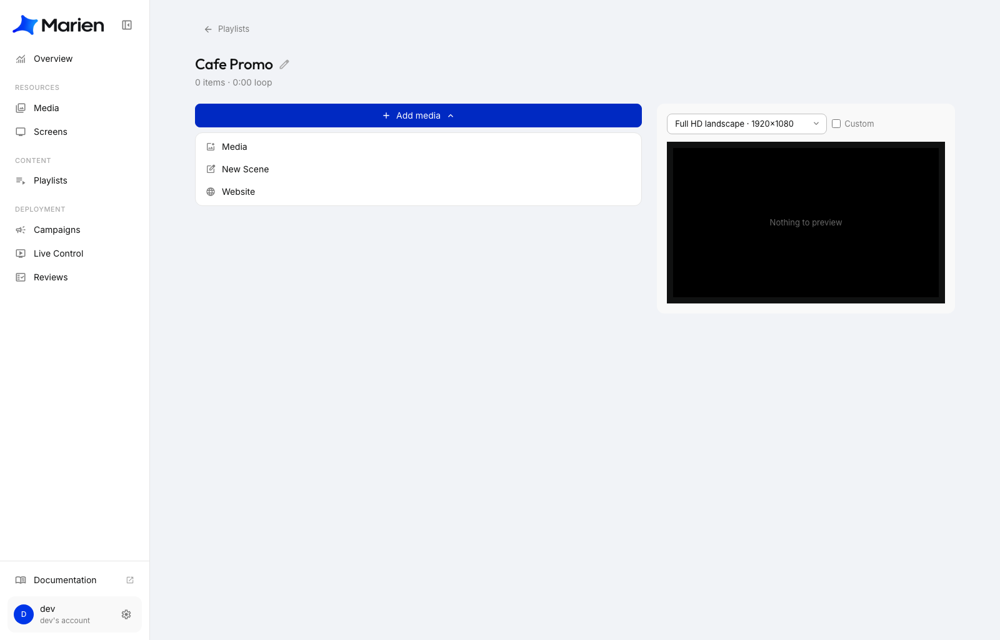
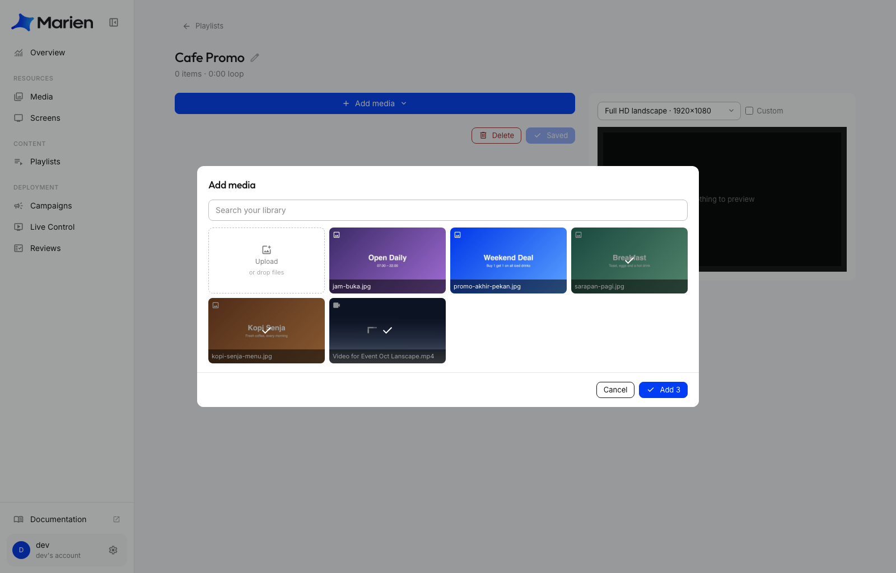
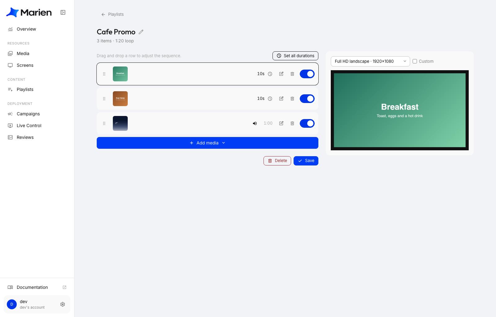
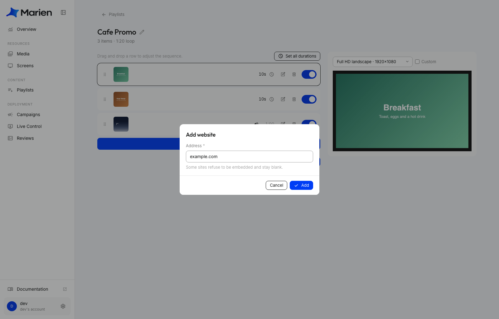
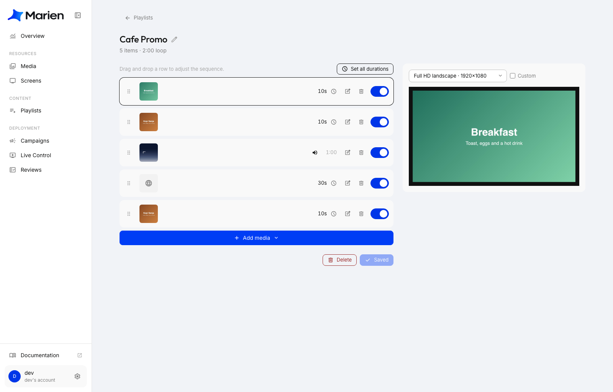

# Buat Playlist

Playlist adalah daftar tayangan yang diputar layar satu per satu, berulang terus. Setiap item bisa berupa gambar, video, situs web, atau scene yang kamu rancang sendiri.

## Mulai playlist baru

**1.** Di Marien CMS, buka **Playlists** lalu klik **New playlist**. Beri nama, lalu klik **Create**.

**2.** Klik **Add media**. Akan muncul menu kecil dengan tiga pilihan: **Media**, **New Scene**, dan **Website**. Setiap pilihan dijelaskan di bagian berikut.

## Tambahkan gambar dan video

**3.** Pilih **Media**. Centang gambar dan video yang kamu mau. Boleh memilih beberapa sekaligus. Untuk memakai file baru, klik **Upload** (atau seret file ke kotaknya). Setelah itu klik **Add**.

Setiap pilihan menjadi satu baris di playlist-mu.

!!! note
    Gambar tampil selama 10 detik, dan lamanya bisa diubah (lihat di bawah). Video diputar sampai selesai. Video dimulai tanpa suara. Klik ikon speaker di baris video kalau kamu ingin suaranya menyala.

## Tambahkan situs web

**4.** Klik **Add media**, lalu **Website**. Ketik alamat situsnya (misalnya `example.com`) dan klik **Add**.

!!! warning
    Beberapa situs tidak mengizinkan dirinya ditampilkan di dalam halaman lain, sehingga hasilnya kosong. Cek pratinjau di sebelah kanan. Kalau di sana kosong, di layar juga akan kosong.

## Tambahkan scene

**5.** Klik **Add media**, lalu **New Scene**. Ini membuka kanvas tempat kamu bisa menggabungkan beberapa gambar, video, teks, bahkan cuaca dalam satu tampilan, mirip Canva. Panduannya ada di halaman sendiri: [Rancang Scene](designing-a-scene.md).

## Atur urutan dan simpan

**6.** Rapikan playlist-mu:

- Geser baris ke atas atau bawah untuk mengubah urutan.
- Klik waktu di sebuah baris (misalnya **10s**) untuk mengubah berapa lama item itu tampil. **Set all durations** mengubah semua baris sekaligus.
- Klik ikon pensil untuk mengedit scene, atau ikon tempat sampah untuk menghapus item.
- Pakai tombol geser di sebelah kanan untuk melewati sebuah item tanpa menghapusnya.

Klik **Save**.

!!! tip
    Pratinjau di sebelah kanan menampilkan playlist dalam bentuk layarmu. Pilih layarmu di menu dropdown-nya untuk memeriksa apakah semuanya pas.

!!! note "Playlist ini sudah tayang di layar?"
    Kalau kamu pemilik akun (owner), **Save** langsung menayangkannya, dan layar akan mengikuti perubahan dalam beberapa detik. Kalau kamu sub-account, perubahanmu dikirim dulu ke owner untuk disetujui. Lihat [Cara Kerja Review](how-reviews-work.md).

Berikutnya: [Buat Campaign](creating-a-campaign.md) untuk menayangkannya di layar.
