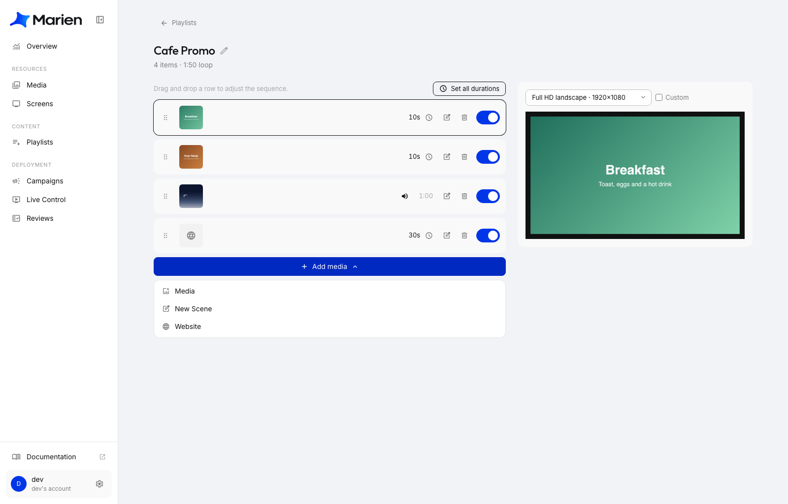
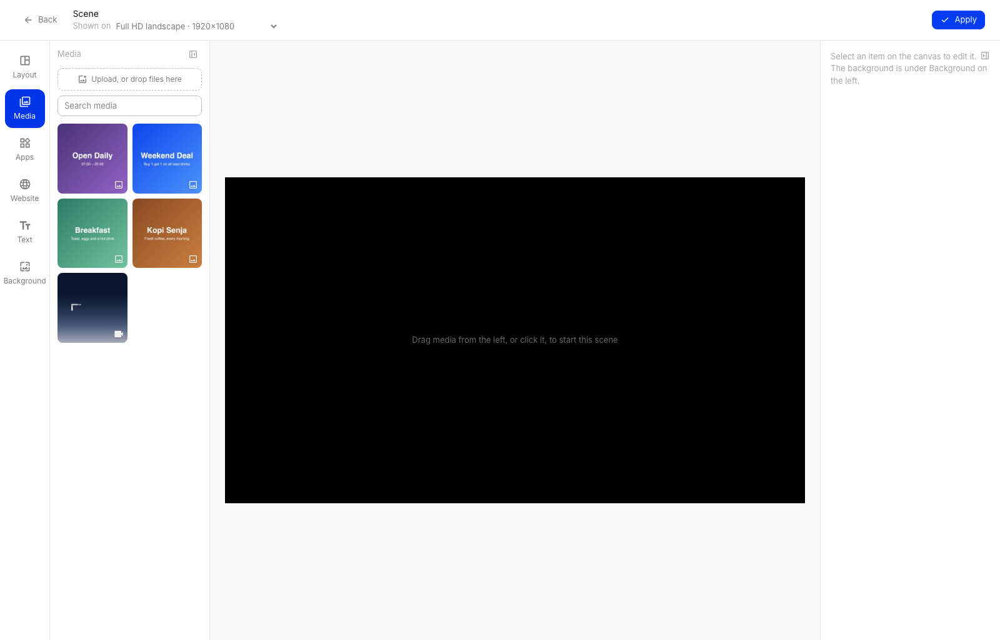
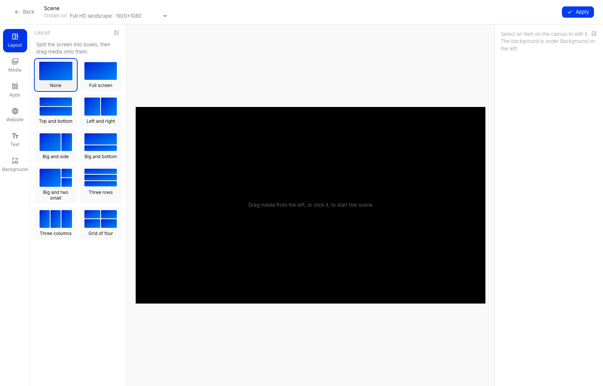
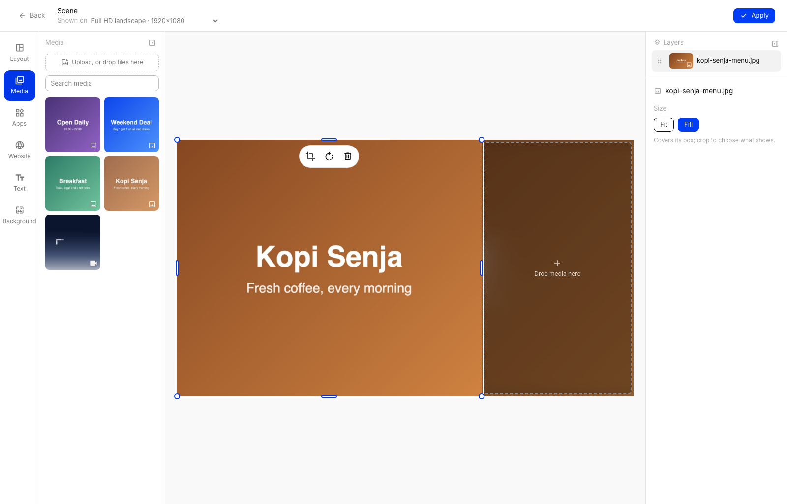
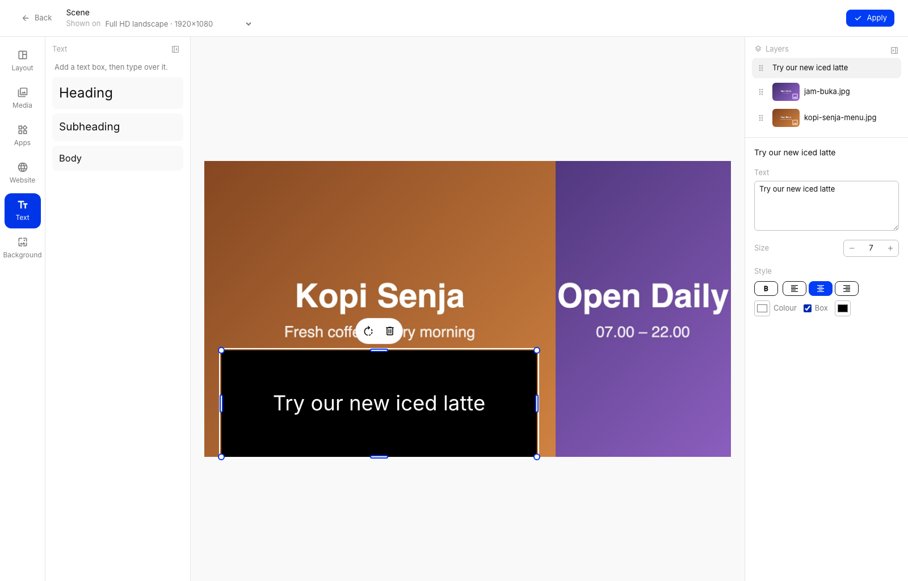
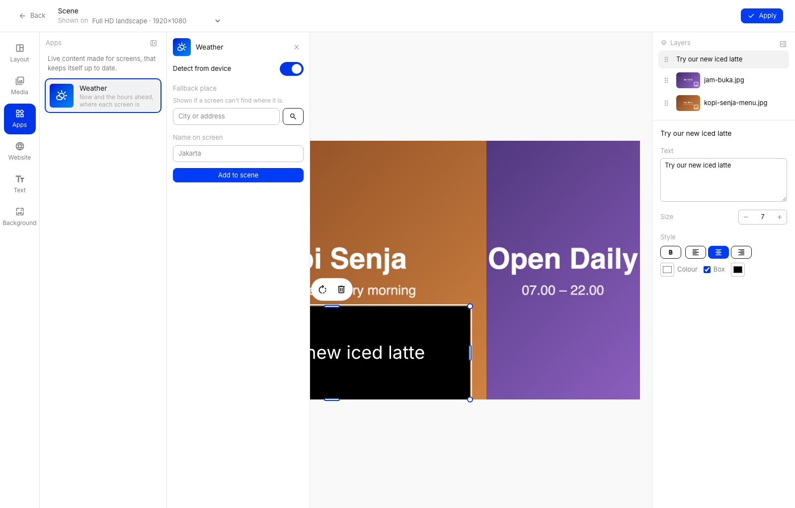
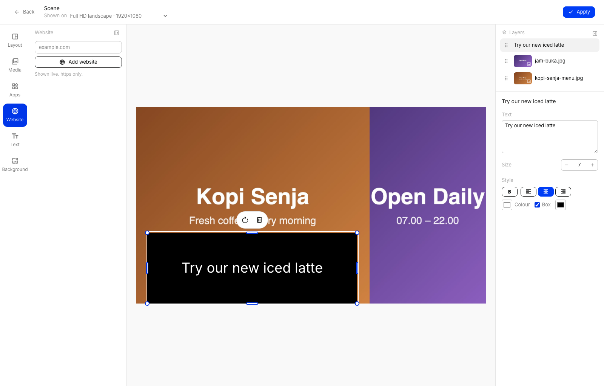
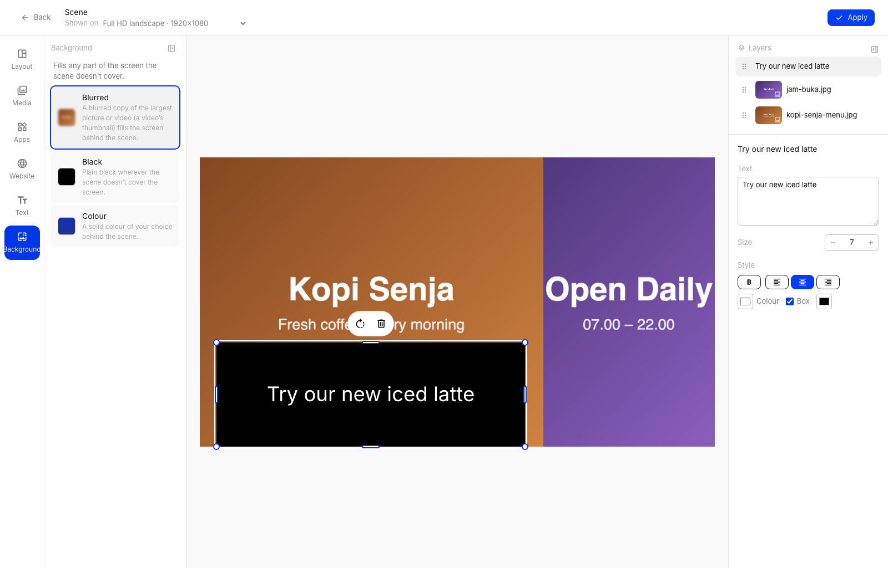
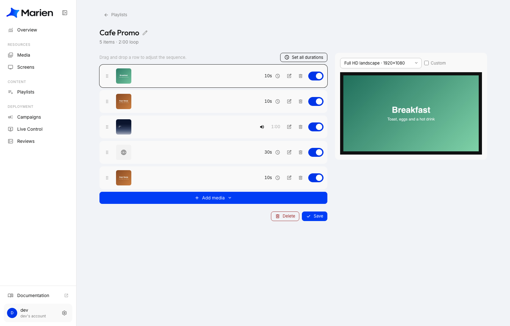

# Design a Scene

A scene is one full screen that you design yourself. You can put pictures, videos, text, a website or the weather on it, side by side or on top of each other. It works a bit like Canva or a slide in a presentation.

Use a scene when one picture or one video isn't enough. For example: a menu picture on the left, today's weather on the right, and a line of text at the bottom.

## Open the scene editor

**1.** Open a playlist (see [Create a Playlist](creating-a-playlist.md)). Click **Add media**, then **New Scene**.

**2.** The editor opens on top of the page. Take a moment to look around:

- **Left:** the tools: **Layout**, **Media**, **Apps**, **Website**, **Text** and **Background**.
- **Middle:** the canvas, which is your screen.
- **Right:** the **Layers** list and the settings of whatever you've clicked.
- **Top:** **Shown on** is the screen shape you're designing for. Pick your own screen here so what you see is what the screen will show. **Apply** saves the scene.

## Split the screen into boxes (optional)

**3.** Click **Layout** and pick a layout, for example **Big and side**. The canvas is cut into boxes. Anything you add goes into a box. Choose **None** if you'd rather place things freely.

## Add pictures and videos

**4.** Click **Media**, then click a picture or video, or drag it onto the canvas. With a layout, it fills the next empty box. To use a new file, click **Upload**.

Click an item on the canvas to change it:

- Drag it to move it. Drag a corner or an edge to resize it.
- **Fit** shows the whole picture. **Fill** covers the whole box and may cut off the edges. With **Fill** you can use the crop icon to choose which part shows.
- The turning arrow rotates it a quarter turn, and the bin icon deletes it.
- On a video, you can also choose **Mute** or **Unmute**.

## Add text

**5.** Click **Text**, then click **Heading**, **Subheading** or **Body**. A text box appears. Type your own words in the **Text** box on the right.

You can change the **Size**, make the text **B**old, align it left, centre or right, change its **Colour**, and tick **Box** to put a coloured block behind it. Drag the text box to where you want it.

## Add the weather

**6.** Click **Apps**, then **Weather**. Leave **Detect from device** on and the screen shows the weather of the place where it stands. Or switch it off and type a city. Type the name to show on screen, then click **Add to scene**.

## Add a website

**7.** Click **Website**, type the address and click **Add website**. The website is shown live, and it must start with `https`.

## Choose a background

**8.** Click **Background** to decide what fills the parts of the screen your items don't cover:

- **Blurred:** a blurred copy of your biggest picture or video.
- **Black:** plain black.
- **Colour:** a colour you pick.

## Finish

**9.** Click **Apply**. You're back in the playlist, and the scene is a new row. Click **Save** on the playlist to keep it.

To change a scene later, click the pencil icon on its row.

!!! tip
    The **Layers** list on the right shows everything in the scene. Click a name to select that item. Drag a name up or down to decide which item sits on top.

!!! warning
    Videos, websites and apps play live on the screen, which is heavy work for it. One scene can hold up to 2 of them, and only 1 video. Pictures and text have no limit.

Next: [Create a Campaign](creating-a-campaign.md) to put your playlist on a screen.
