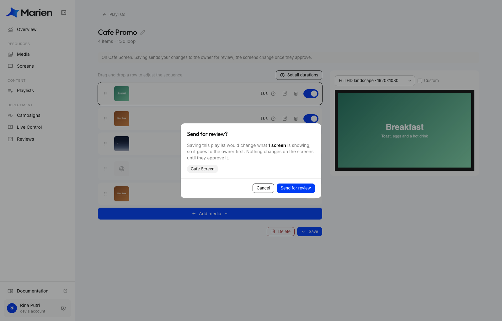
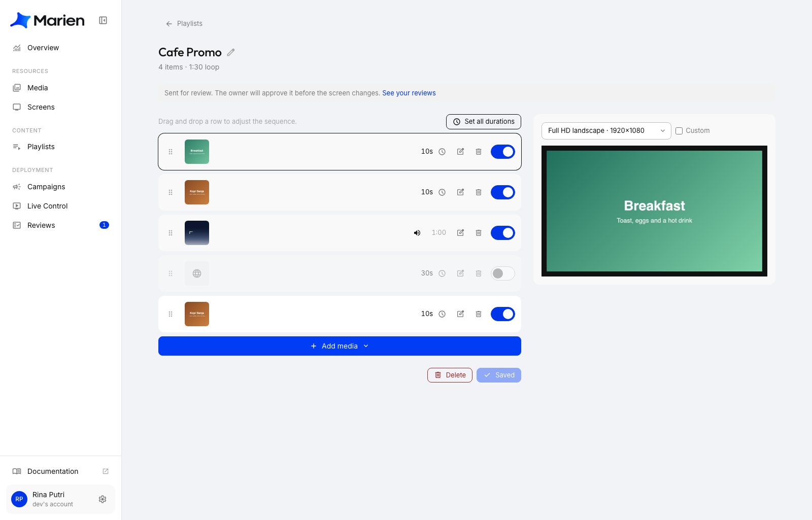
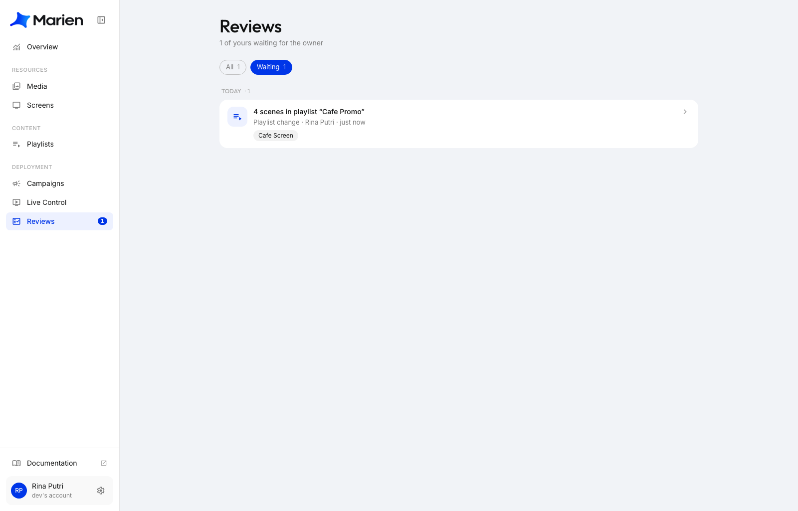
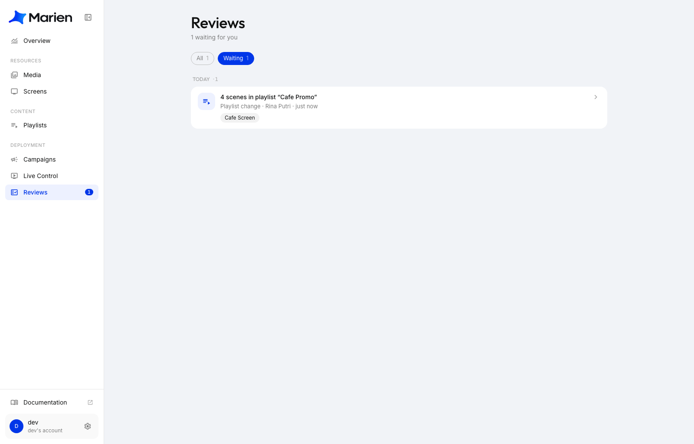
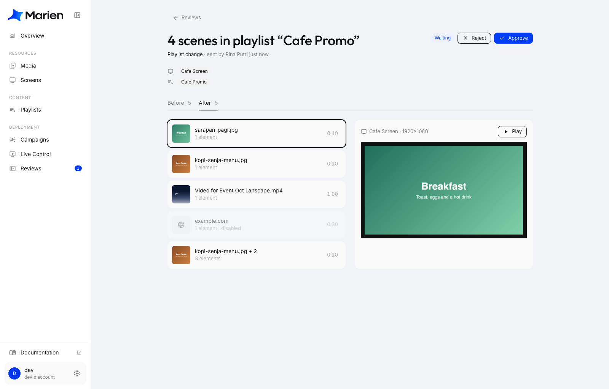
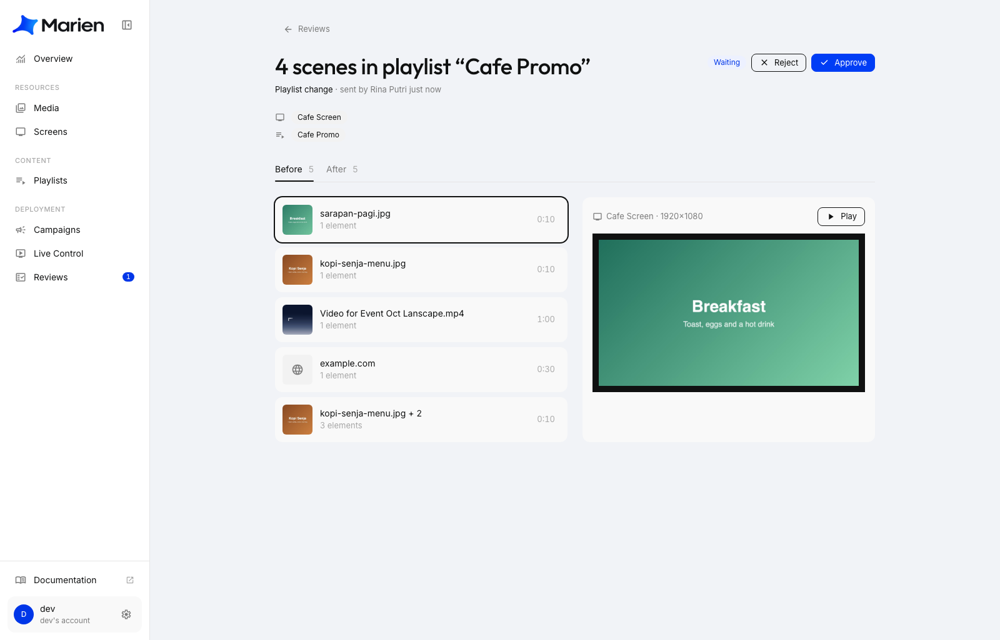
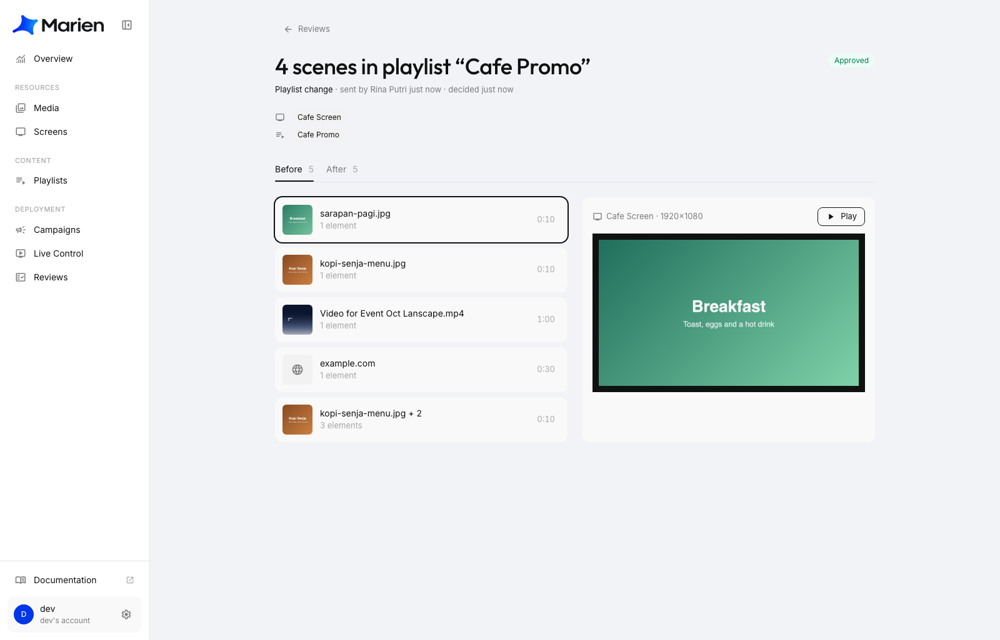
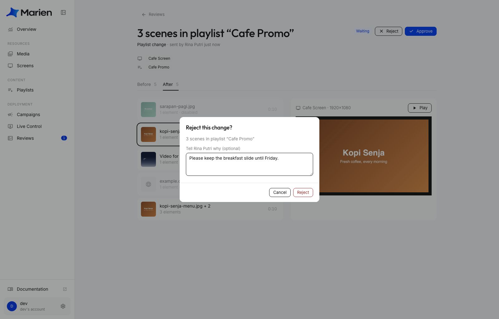
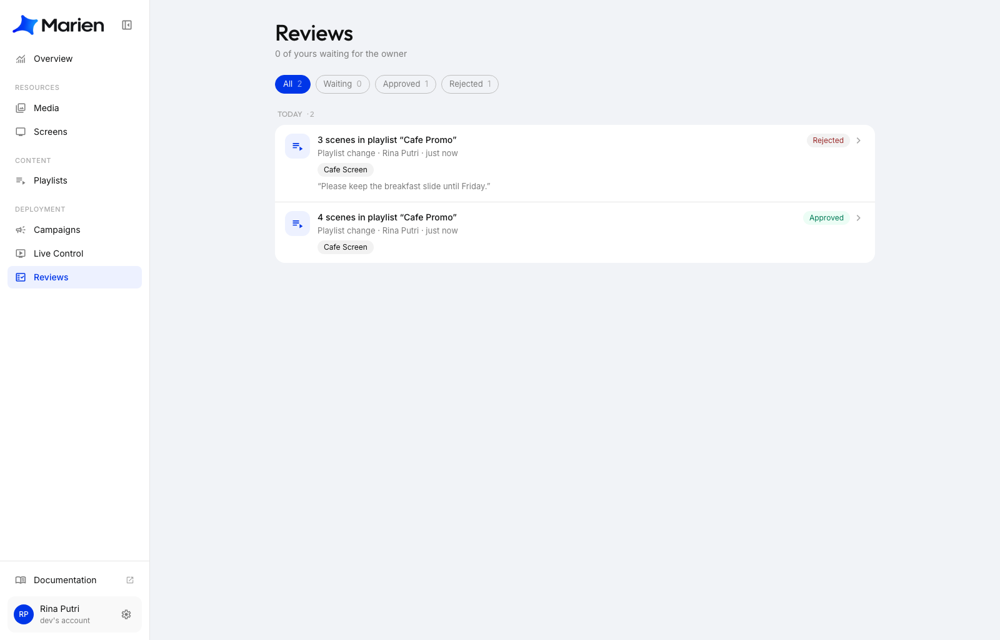

# How Reviews Work

Reviews let the owner of an account check changes before they reach the screens. When a [sub-account](adding-a-sub-account.md) saves something that would change what a screen shows, the change waits in **Reviews**. The owner looks at it, then approves or rejects it. Until then, the screens keep showing what they showed before.

Owners don't need reviews. Their changes go straight to the screens.

## What needs a review?

When a sub-account does any of these, the owner has to approve it first:

- Saving a playlist that is playing on a screen
- Creating, changing or deleting a campaign
- Creating, changing or deleting a schedule
- Choosing which playlist a screen plays

Everything else is saved right away. For example uploading media, renaming something, or editing a playlist that isn't on any screen yet.

## If you're a sub-account: send a change

**1.** Edit the playlist (or campaign) and click **Save**. A box asks **Send for review?**. It lists the screens that would change. Click **Send for review**.

**2.** A message at the top says **Sent for review**. Nothing has changed on the screen yet.

**3.** To follow it, open **Reviews** in the menu. Your change is listed as **Waiting**.

!!! tip
    Changed your mind? Open the review and click **Withdraw** while it is still **Waiting**.

## If you're the owner: approve or reject

**4.** When a change arrives, **Reviews** in the menu shows a small number. Open **Reviews** and click the change.

**5.** The page shows who sent it and which screens it touches. Use the **Before** and **After** tabs to compare. Click an item to preview it in the shape of the screen, and **Play** to watch the preview.

**6.** Click **Approve** if it looks good. The change is applied, and the screens pick it up within a few seconds. The review is marked **Approved**.

**7.** Or click **Reject**. You can add a note that explains why, so the person knows what to fix. Then click **Reject** again. Nothing changes on the screens.

## See the result

The person who sent the change finds it under **Reviews** as **Approved** or **Rejected**. If you wrote a note, they can read it there.

