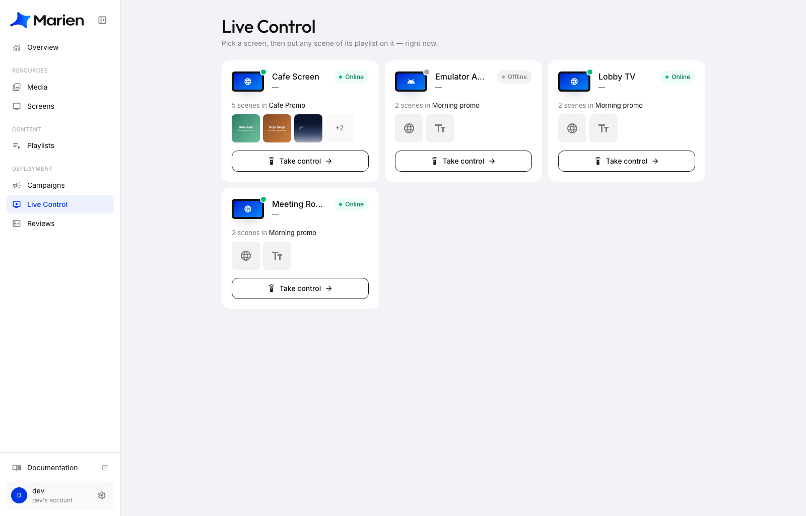
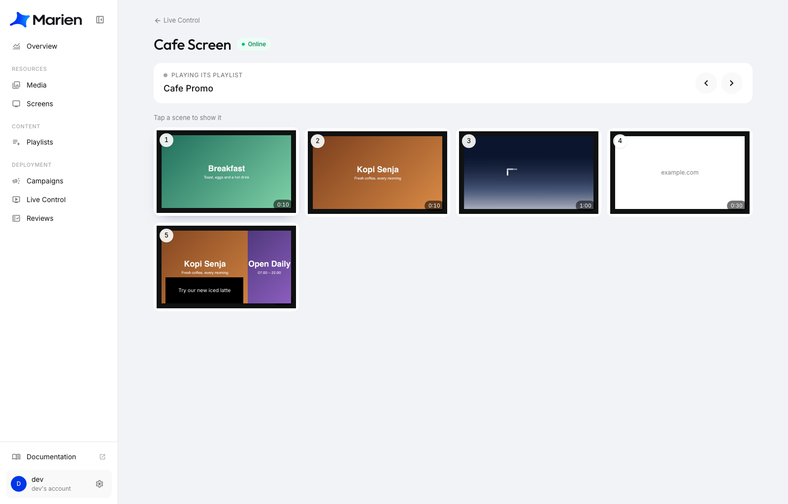
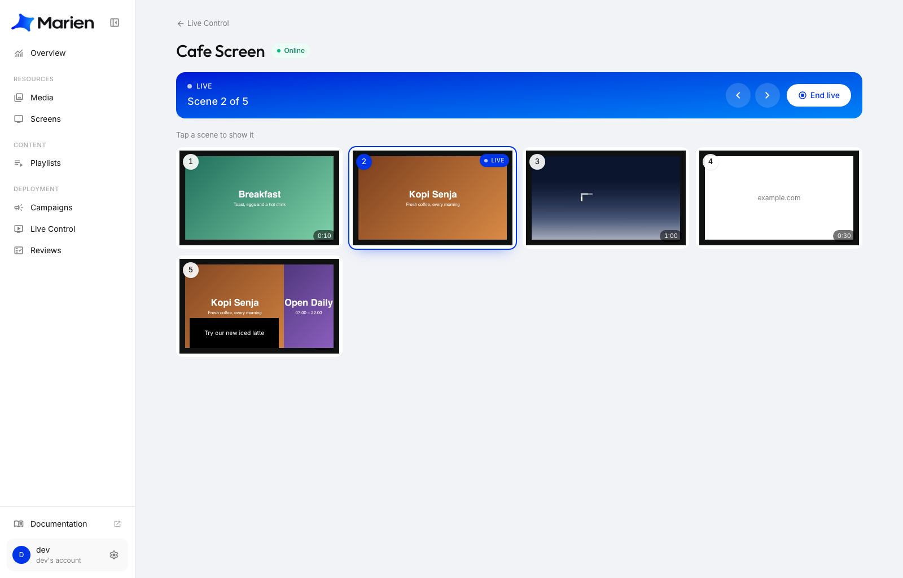

# Live Control

Live Control adalah remote untuk layar-layarmu. Pilih sebuah layar, ketuk salah satu scene-nya, dan scene itu langsung tampil di layar saat itu juga. Cocok untuk kabar mendadak, promo spesial, atau saat kamu ingin menunjukkan satu slide tertentu kepada pelanggan.

Fitur ini bisa dipakai di layar mana pun yang sedang memutar playlist. Kalau sebuah layar belum punya playlist, lihat [Buat Campaign](creating-a-campaign.md).

## Ambil kendali atas sebuah layar

**1.** Di Marien CMS, buka **Live Control**. Kamu akan melihat satu kartu untuk setiap layar, berisi namanya, statusnya **Online** atau **Offline**, dan playlist yang sedang diputar.

**2.** Klik **Take control** di layar yang kamu mau. Kalau di kartunya tertulis **Assign a playlist**, berarti layar itu belum punya apa pun untuk dikendalikan.

**3.** Remote akan terbuka. Gambar-gambarnya adalah scene dari playlist tersebut, diberi nomor sesuai urutan tayang. Di bagian atas, tertulis playlist apa yang sedang diputar layar.

## Tampilkan sebuah scene sekarang juga

**4.** Ketuk sebuah scene. Sesaat kemudian layar akan berpindah ke scene itu dan tetap di sana. Bar di atas berubah menjadi biru dan bertuliskan **Live**, lengkap dengan nomor scene-nya.

- Panah kiri dan kanan berpindah ke scene sebelumnya atau berikutnya.
- Ketuk scene lain kapan saja untuk berpindah ke sana.

## Kembali seperti biasa

**5.** Klik **End live**. Layar akan kembali memutar playlist-nya seperti semula.

!!! note
    Scene yang sedang live akan tetap tampil sampai kamu klik **End live**, tetapi paling lama 4 jam. Setelah itu layar kembali memutar playlist-nya sendiri, jaga-jaga kalau ada yang lupa mengakhirinya.

!!! tip
    Butuh pesan cepat, misalnya "Tutup lebih awal hari ini"? Buat scene-nya (lihat [Rancang Scene](designing-a-scene.md)), masukkan ke playlist layar itu, lalu tampilkan lewat Live Control.

!!! note
    Scene yang kamu matikan di playlist (lewat tombol geser di sebelah kanan barisnya) dilewati oleh layar, jadi tidak muncul juga di remote.

!!! warning
    Kalau layar sedang **Offline**, perubahannya baru sampai setelah layar tersambung ke internet lagi.
